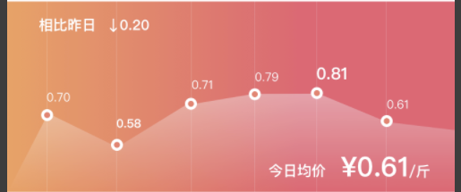

## 目标结果

## 实现点
- 用canvas实现

## 分析输入数据:
- solt:
  - header
  - footer
  - pointer

- porps:
  - height 
    为空，则不显示

  - width 
    为空，则不显示

  - vauleList 
    必须为数组，非数组不显示，可以接受空数组

  - direction 
    接受两个值：V和H ，默认为H 
    H:从左至右 
    V:从下到上

  - options
    - paddingLeft 
      默认为0
    - paddingRight 
      默认为0
    - paddingTop 
      默认为0
    - paddingBottom 
      默认为0
    - headerAlign 
      接受三个值:right,center,left,默认为true 
      默认居中
    - footerAlign 
      接受三个值:right,center,left,默认为true 
      如果为空，默认不显示
    - startBgColor 
      直接收类似"#ffeedd"这种16进制 
      如果为空或不合法，就不显示背景色（从左到右，或者从下到上）
    - endBgColor 
      直接收类似"#ffeedd"这种16进制 
      如果为空或不合法，就不显示背景色（从左到右，或者从下到上）
    - gradient 

    - pointStyle 
      接受一个值：normal，默认normal
